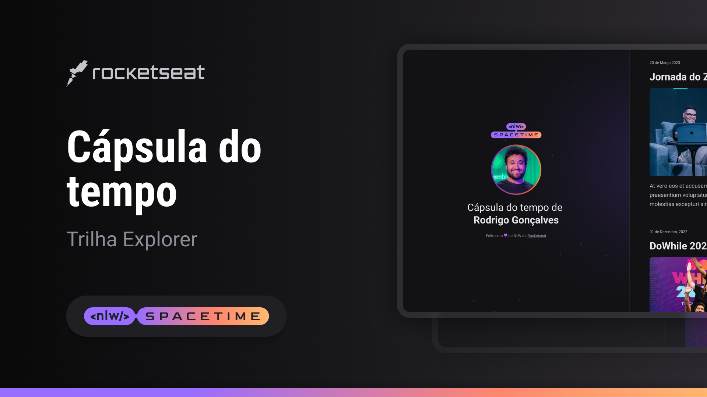

  

## Projeto
esse é um projeto Web Responsico de uma Cápsula do tempo para exibir memórias em uma linha do tempo. 

## Tecnologias
Esse projeto foi desenvolvido durante o NLW da Rocketsear com as seguintes tecnologias

- HTML
- CSS
- Git e Github

## Layout 
Você pode acessar o layout do projeto através [desselink](https://www.figma.com/file/V9ys42XdGqoHTgdyWrCOQT/C%C3%A1psula-do-tempo-%E2%80%A2-Trilha-Explorer-(Community)?type=design&node-id=306%3A3&t=GbL1nHY5UKKK53tA-1)
